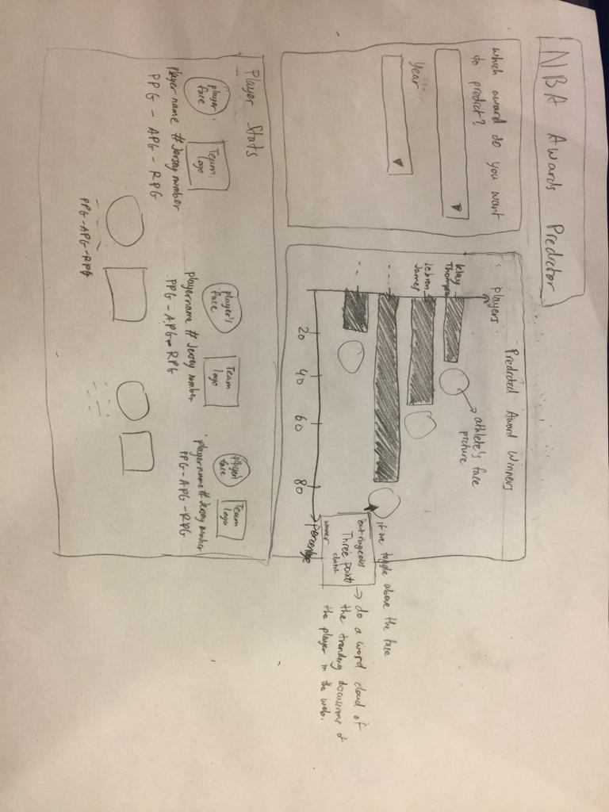

```{r set-options, include = FALSE}
# Sets default chunk options
knitr::opts_chunk$set(
  # Figures/Images will be centered
  fig.align = "center", 
  # Code will not be displayed unless `echo = TRUE` is set for a chunk
  echo = FALSE,
  # Messages are suppressed
  message = FALSE,
  # Warnings are suppressed
  warning = FALSE
)
```

```{r install-and-load-packages, include = FALSE, eval=FALSE}
# All packages needed should be loaded in this chunk
pkg_list = c('knitr', 'kableExtra', 'magrittr', 'bookdown')

# Determine what packages are NOT installed already.
to_install_pkgs = pkg_list[!(pkg_list %in% installed.packages()[,"Package"])]

# Install the missing packages
if(length(to_install_pkgs)) {
  install.packages(to_install_pkgs, repos = "https://cloud.r-project.org")
}

# Load all packages
sapply(pkg_list, require, character.only = TRUE)
```

<!-- Force a new page -->
\newpage

# Instructions

This document will walk you through some of the necessary steps of formatting
your report. Do not mistake the length of this document as an example of the 
length of a proper report. Length is not important. Communicating your idea 
in a concise but complete manner is important. The goal of the proposal is to capture details found in Figure \@ref(fig:data-science-workflow).

```{r data-science-workflow, out.width = "250px", fig.cap = "Data science workflow emphasized in R4DS. The photo has been reduced using chunk size options."}
knitr::include_graphics("images/data-science.png")
```


# Introduction


The **introduction** section provides a preview of the project's focus. Within
this section, provide an overview on the selected topic for the consumption of a
manager. In essence, the manager must be able to understand what the project is
and why they should support the endeavor. You are allowed to make the assumption
that the manager is knowledgeable in base R concepts. Make sure to answer the
following questions:

- What problem or topic are you addressing?
  
  We are predicting NBA award winners and looking back at previous award winners and determining the validity of their candidacy.
  
- Why is it interesting or important? In particular, what evidence supports this conclusion?
  
  Valuing player assets are important. Being able to accurately determine player value is one of the most fundamental skills in basketball front offices. Being able to do so accurately can be the difference between winning and losing. Many different subjects (statistitcs, differential equations, analytics) can be applied to these problems. With the success of Daryl Morey and Sam Hinkie, we see that these approaches have been successful in the NBA. Many interesting and unsolved issues in the NBA require statistical analysis, which is why we chose this project.
  
- Cite papers or reputable sources that back up this claim. (You may want to find - material using Google Scholar.)
<http://www.basketballanalyticsbook.com/>
<https://www.nbastuffer.com/analytics-101/>
<https://squared2020.com/>

- Where did the problem or topic come from?

Our shared passion of basketball and the NBA led us to this topic. This is a topic that some of us have talked about and  previous academic curiousity have led us to this topic. We wanted to know if we could use a variety of variables to accurately predict NBA Award winners.

- What is your idea for addressing the problem or topic?

First, find and clean NBA player data. Then create a series of advanced metrics to measure player performances. Train a model that utilizes these metrics to correlate them with team success. Finally, calculate total offensive value, total defensive value, and total overall value to determine player awards. Finally, test its predictive power on a series of previous award winners and visualize our results.

- How does your idea match with the course’s focus on statistical programming?

We will be dealing with large datasets, validating data, and building statistical models. All of these skills form the foundations of statistical programming and we will apply what we have learned in our project.

-What is our data? Where did it come from? How will it be useful in answering your problem?

Our data will come from the official NBA website. It will be 30 years of individual player data. The long time period and amount of data for our data points will allow us for a greater degree of accuracy and precision in the evaluation of our model.

<https://stats.nba.com/>

# Related Work

Address the following questions:

- What other ideas have been attempted?

While not specifically related to this project, the application of sabermetrics has become a point of interest for many baseball teams. Likewise, we have began to see this same transition in basketball analytics. The long term view of teams that have embraced analytics has been very good: the Philadelphia 76ers and Houston Rockets are both top seeded teams that have a significant chance at being the Championship team. While we haven't seen rigorous academic analysis of predicting NBA awards, there have been some implementations done by various individuals. There are also award trackers that just use raw data - specifically VORP (Value over Replacement Player) and PER (Player Efficiency Rating) and the player with the highest value is predicted to win. While these ways of predicting awards works somewhat well, they tend to have problems undervaluing certain players (the inventor of PER notes that it is not an end all metric - it rewards inefficient shooting and doesn't sufficiently reward effective defense) so our idea will be unique.

- Why is your team's idea original compared to prior work?

A lot of the statistics in use with modern publications are based on the research of one individual: Daryl Morey. We will derive our own variables and determine how impactful they are in determining wins using a regression  model. By doing so, we will establish other variables and metrics that may be better suited for different situations and will allow for better comparison of players across time periods and eras.

# Methods

The **methods** section should discuss how you plan to solve your problem.
The overall details of the project including any preliminary work. In 
particular, the implementation details behind the approach should be explained
at length here. The more details you can provide, the better feedback your
group can receive. As a result, the section serves as a roadmap of what features
are going to be developed and any external dependencies that are required. 
**The majority of your code should be _suppressed_ from the displaying in this
section**. Please refer to code and figures placed in the appendix. The latter can be referenced using: 

```
Figure \@ref(fig:code-chunk-name-here).
```

For example, the figure of the data science workflow is accessible via
Figure \@ref(fig:data-science-workflow).

To satisfy this section, provide detailed responses for the following:

- What packages will you use in your implementation?
  - Data transformation: tidyr, dplyr, ballr
  - Data visualization: ggplot2, plotly, gganimate
  - Interactive Interface: shiny
  - Regression Analysis: leaps, glmnet, caret
  
- What code will the group need to write for the project?
  1. Code for importing the data
  2. Code for cleaning the pre-collected data and randomizing it
  3. Code to create the linear regression in obtaining the weights for each respective variables
  4. Code to create the toggle bar for the user interface input
  5. Code to create the interactive bar graph where it also displays the summary of the players
  
- Provide low-fidelity prototypes (e.g. _sketches_ on paper) in the **Appendix** of:
    - Visualisations
        - What kinds of graphs will you use?
        
        We will use a horizontal bar graph where the y-axis contains the player's names and the x-axis contains the predicted percentage scores. We will put a picture of the athlete on the right side of their respective bars. The user will be able to interact with the graph by toggling on the face of the athlete and a word cloud will appear. The word cloud will consist of the google trending discussions on the athlete.
        - Label axes, provide a title, and mention any interactivity.
    - Interface
        - All projects need a Shiny Application.
        - Sketch how a user will work with the shiny application.
        

- What have you done or learned so far for the project? 

We have learned that we need to gather the statistical player data and filter them so that the we have relevant data. We need to gather the variables and do regression to determine weights of each variables. We need to gather data on player discussion trends to project it in the graph. We also need to create a user interface where the we get the user input data and graph the predicted results as well as the player statistics.

We are primarily wanting to ensure that your project has met the criterion
of the data science pipeline. In essence, we want to see evidence that your
project has:

- Reading data into _R_ or accessing data via an API.
- Data transformations (e.g. Tidying ([`tidyr`](http://tidyr.tidyverse.org/)), Summarizing ([`dplyr`](http://dplyr.tidyverse.org/)), et cetera.)
- Data visualization (e.g. [`ggplot2`](http://ggplot2.tidyverse.org/),
  [`plotly`](https://plot.ly/ggplot2/), [`gganimate`](https://github.com/dgrtwo/gganimate))
- R functions either in external packages or included in a new _R_ package
- Interactive Interface (e.g. [`shiny`](https://shiny.rstudio.com/))
- Reproducibility

# Feasibility

The **Feasibility** section is meant to act as a way to reflect upon the proposal.
Generally speaking, there will be three weeks of heavy development time afforded
to the group. Building a detailed ecosystem or heavily scripting in a different
language will likely not lead your team to success. Hence, please provide
a project management overview of *who* on your team will be doing *what* and *when*
by answering:

- Is this project able to be completed before the end of the semester?

It should be - while the data set is large, outside of the resource requirement, it should not be overly difficult to implement this specific idea. We will need to familiarize ourself with the specific data used here - lots of unique compiled stats are used in basketball as opposed to the typical counting stats. 

- What steps must occur to complete the project before the end of the semester?

Accumulate the data in a timely manner - we must find what data we are going to use and apply our model to it. We plan to have 30 years worth of data so data cleaning/valdiation is an important and time consuming portion. We must also create specific derived variables that will more effectively illustrate the value of each player to their team for all the specific criteria. We must then model each of the awards - they will all have unique weights for each of the statistics.

- What is the work plan to accomplish the necessary tasks before the end of the
  semester?
  - Specify who is doing what and when.
  - Consider making a [Gantt chart](https://en.wikipedia.org/wiki/Gantt_chart)
    to highlight each stage of the project.
    
    Ajay - obtain data (primarily from BBallRef) and create derived variables
    Bhanu - build model and generate output (train model for each individual award)
    Joshua and Eric - build visualization components of the Shiny app
    Ajay and Bhanu - add sentiment analysis portion to visualizations (make a word cloud)

# Conclusion

If you can accurately predict NBA awards, there is significant money to be made
betting on winners of these awards. Additionally, by looking at this topic,
NBA teams can get a better idea of what a winning player looks like, and can
construct teams accordingly.

This project will involve looking at 30 years of individual NBA player statistics. 
We will develop a number of new advanced analytics and statistics to determine 
player efficient and value. Using these numbers, we will rank players and determine
who should win prominent NBA awards. We will visualize these results using bar graphs 
and sentiment analysis.

\newpage

# Appendix

The **Appendix** section contains figures, sample data, and other miscellaneous
entries. Generally, this sketch seeks to contain all of your _planning_ information.

- Provide the sketches of visualisations and the shiny application.
- Provide an overview on the desired functions.
    - What is a function's input? Output? How are functions related to each other.
    - For example, `read_data("hospital_data.csv")` must be called before `tidy_hospital()`, et cetera.
- Provide a sample of the data set you intend to use (~10 observations).

```{r}
example = read.csv("example.csv")
print(example)
```


If you used previous code chunks within the document, this information can
be dynamically retrieved and embedded.

```{r, ref.label=knitr::all_labels(),echo=TRUE,eval=FALSE}
```

```{r hitters-data, eval=FALSE}
kable(
  head(mtcars, 20),
  format = "latex",
  caption = "This is an example of a table in the Appendix. Notice that it is way too big, and has way too much information. We use the $\\texttt{kableExtra}$ package to shrink it down, but even then, no one would actually read this table.",
  booktabs = TRUE
) %>%
  kable_styling(latex_options = c("striped", "scale_down"))
```

```{r wage-data, eval=FALSE}
kable(
  head(mtcars, 20),
  format = "latex",
  caption = "This is another example of a ridiculous table. Notice that it is automatically numbered.",
  booktabs = TRUE
) %>%
  kable_styling(latex_options = c("striped", "scale_down"))
```


## Formatting Notes


### `R` Code and `rmarkdown`

An important part of the report is communicating results in a well-formatted manner. This template document should help a lot with that task. Some thoughts on using `R` and `rmarkdown`:

- Chunks are set to not echo by default in this document.
- Consider naming your chunks. This will be necessary for referencing chunks 
  that create tables or figures.
- One chunk per table or figure!
- Tables should be created using `knitr::kable()`.
- Consider using `kableExtra()` for better presentation of tables. (Examples in this document.)
- Caption all figures and tables. (Examples in this document.)
- Use the `img/` sub-directory for any external images.
- Use the `data/` sub-directory for any external data.

### LaTeX

While you will not directly work with LaTeX, you may wish to have some details
on working with TeX can be found in 
[this guide by UIUC Mathematics Professor A.J. Hildebrand ](https://faculty.math.illinois.edu/~hildebr/tex/latex-start.html).

With `rmarkdown`, LaTeX can be used inline, like this, $a ^ 2 + b ^ 2 = c ^ 2$,
or using display mode,

$$
\mathbb{E}_{X, Y} \left[ (Y - f(X)) ^ 2 \right] = \mathbb{E}_{X} \mathbb{E}_{Y \mid X} \left[ ( Y - f(X) ) ^ 2 \mid X = x \right]
$$

You **are** required to use BibTeX for references. With BibTeX, we could 
reference the `rmarkdown` paper [@allaire2015rmarkdown] or the tidy data paper.
[@wickham2014tidy] Some details can be found in the 
[`bookdown` book](https://bookdown.org/yihui/bookdown/citations.html). Also,
hint, [Google Scholar](https://scholar.google.com/) makes obtaining BibTeX 
reference extremely easy. For more details, see the next section...

<!-- Force a new page for references -->
\newpage

# References

The **References** section acts as a bibliography for all papers referenced
in the **Introduction**, **Related Works**, and **Method** sections. The
references should be formated in Chicago author-date format, which is the
default for RMarkdown.

* Provide a list (5+) of papers or items you have read to write this proposal. 
* Please list all _R_ packages or software referenced.

To acquire software citation information, _R_ has a built-in command
that creates a BibTex and in-line text citation. To generate the citation
of an installed _R_ package, type:

```r
# In R
citation(package="pkg_name")
```

For example, to cite `dplyr`, one would generate the BibTex entry from:

```r
citation(package="dplyr")
```

```latex
@Manual{dplyr:2018,
    title = {dplyr: A Grammar of Data Manipulation},
    author = {Hadley Wickham and Romain François and Lionel Henry and Kirill Müller},
    year = {2018},
    note = {R package version 0.7.7},
    url = {https://CRAN.R-project.org/package=dplyr},
}
```

Note, we added a "name" to the autogenerated citation of `dplyr:2018`. Using
this name, we can reference the work within the paper via [@dplyr:2018] or @dplyr:2018.

<!-- Remove the newpage break when the above text is no longer useful -->
\newpage
